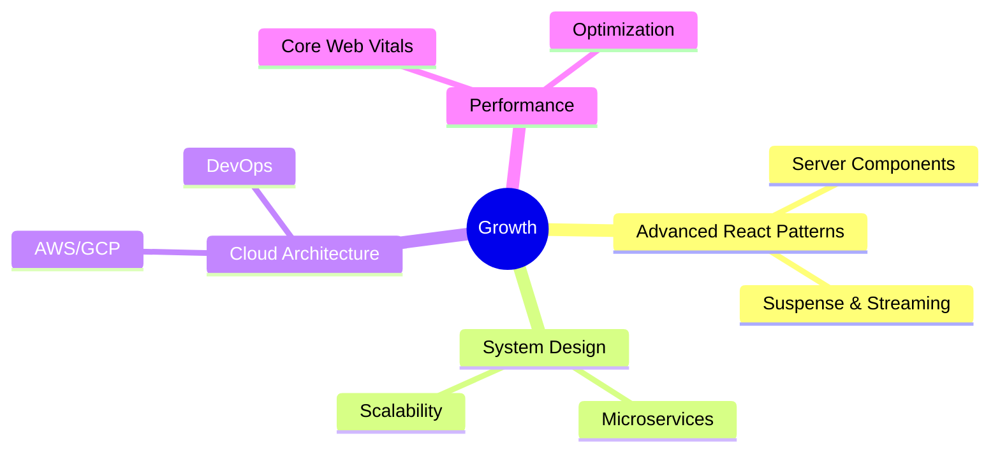

<div align="center">

# 👋 Hello, I'm Rajaire Thomas

### Full-Stack Developer | Building Modern Web Solutions

[](https://your-portfolio.com)
[](https://linkedin.com/in/rajaire-thomas)
[](mailto:contact@rajaire.dev)

</div>

---

## 📊 My GitHub Story in "Hello World"

<div align="center">

```
╦ ╦┌─┐┬  ┬  ┌─┐  ╦ ╦┌─┐┬─┐┬  ┌┬┐
╠═╣├┤ │  │  │ │  ║║║│ │├┬┘│   ││
╩ ╩└─┘┴─┘┴─┘└─┘  ╚╩╝└─┘┴└─┴─┘─┴┘
```

</div>

---

## 💫 About Me

```javascript
const developer = {
  name: "Rajaire Thomas",
  role: "Full-Stack Developer",
  company: "ByteLocke",
  location: "Jamaica 🇯🇲",
  
  currentFocus: [
    "Scalable Web Applications",
    "Developer Experience",
    "Performance Optimization",
    "Clean & Intuitive UI"
  ],
  
  philosophy: "Build fast, build smart, build beautiful",
  
  stats: {
    projectsCompleted: 6,
    systemUptime: "99.9%",
    coffeeDriven: true
  }
};
```

---

## 🛠️ Technology Stack

<div align="center">

### Frontend Development


### Backend Development


### Database & Backend Services


### Additional Technologies


</div>

---

## 📈 GitHub Analytics

<div align="center">


</div>

---

## 🚀 Featured: ByteLocke

<div align="center">

**Modern Web Development Company**

Building scalable, user-focused digital solutions for startups and businesses

`MongoDB` • `Express.js` • `React.js` • `Node.js`

[](https://bytelocke.com)

</div>

### What ByteLocke Delivers
- ⚡ Fast, performant web applications
- 🎨 Clean, modern user interfaces  
- 📱 Responsive, mobile-first design
- 🔧 Scalable architecture built to grow

---

## 💡 Development Approach

<table>
  <tr>
    <td align="center" width="33%">
      <br>
      <h3>🎯 User-Focused</h3>
      <p>Building intuitive experiences that users love</p>
      <br>
    </td>
    <td align="center" width="33%">
      <br>
      <h3>⚡ Performance First</h3>
      <p>Optimized for speed and efficiency</p>
      <br>
    </td>
    <td align="center" width="33%">
      <br>
      <h3>🧩 Scalable</h3>
      <p>Architecture designed for growth</p>
      <br>
    </td>
  </tr>
  <tr>
    <td align="center">
      <br>
      <h3>🎨 Clean Code</h3>
      <p>Maintainable and well-documented</p>
      <br>
    </td>
    <td align="center">
      <br>
      <h3>📱 Responsive</h3>
      <p>Works beautifully on all devices</p>
      <br>
    </td>
    <td align="center">
      <br>
      <h3>🔒 Secure</h3>
      <p>Following best security practices</p>
      <br>
    </td>
  </tr>
</table>

---

## 🌱 Currently Learning



---

## 📊 Contribution Activity

<div align="center">


</div>

---

## 🎯 Project Highlights

<div align="center">

| Project | Description | Tech Stack | Status |
|---------|-------------|------------|--------|
| **ByteLocke** | Web Development Company | MERN Stack | ✅ Live |
| **Portfolio** | Personal Portfolio Site | React, TailwindCSS | ✅ Live |
| **Web Apps** | Various Client Projects | React, Node.js | 🚀 Active |

</div>

---

## 📫 Let's Connect

<div align="center">

### Open to collaboration and interesting projects

**📧** contact@rajaire.dev  
**🌐** [Portfolio](https://rajaire.dev)  
**💼** [LinkedIn](https://linkedin.com/in/rajaire-thomas)  
**📄** [Resume](https://rajaire.dev/resume.pdf)

---


</div>

---

<div align="center">

### ⚡ Fun Fact

```
while (alive) {
    eat();
    sleep();
    code();
    repeat();
}
```

---

**"Code is poetry written in logic"**

Built with 💙 from Jamaica 🇯🇲

</div>
