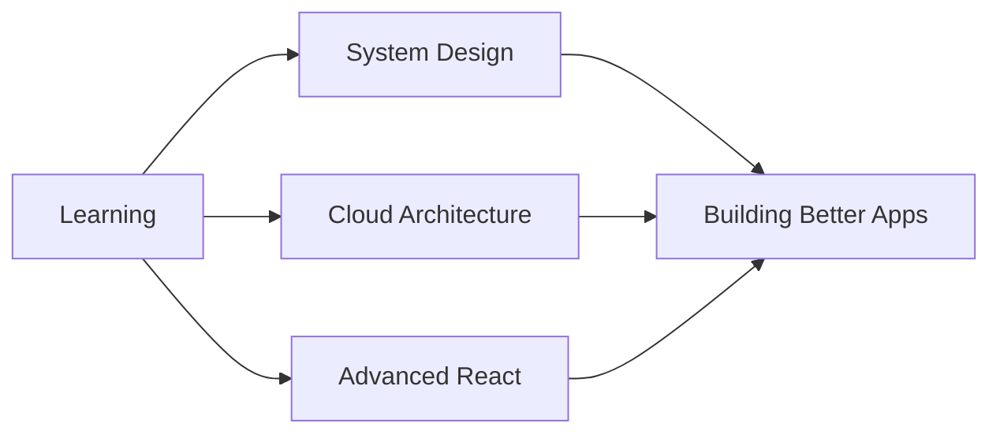

# 👋 Hello World!

<div align="center">
  
```
██╗  ██╗███████╗██╗     ██╗      ██████╗     ██╗    ██╗ ██████╗ ██████╗ ██╗     ██╗██████╗ 
██║  ██║██╔════╝██║     ██║     ██╔═══██╗    ██║    ██║██╔═══██╗██╔══██╗██║     ██║██╔══██╗
███████║█████╗  ██║     ██║     ██║   ██║    ██║ █╗ ██║██║   ██║██████╔╝██║     ██║██║  ██║
██╔══██║██╔══╝  ██║     ██║     ██║   ██║    ██║███╗██║██║   ██║██╔══██╗██║     ██║██║  ██║
██║  ██║███████╗███████╗███████╗╚██████╔╝    ╚███╔███╔╝╚██████╔╝██║  ██║███████╗██║██████╔╝
╚═╝  ╚═╝╚══════╝╚══════╝╚══════╝ ╚═════╝      ╚══╝╚══╝  ╚═════╝ ╚═╝  ╚═╝╚══════╝╚═╝╚═════╝ 
```

### 🚀 Rajaire Thomas | Full-Stack Developer

[](https://your-portfolio.com)
[](https://linkedin.com/in/rajaire-thomas)
[](mailto:contact@rajaire.dev)
[](https://your-portfolio.com/contact)

</div>

---

## 📊 Contribution Calendar: "HELLO WORLD"

<div align="center">

```
     Jan   Feb   Mar   Apr   May   Jun   Jul   Aug   Sep   Oct   Nov   Dec
     ███   ███                                                   ███   ███
     ███   ███                                                   ███   ███
Mon  ███   ███   ███   ███   ███   ███   ███   ███   ███   ███   ███   ███
Tue  ███   ███   ███   ███   ███   ███   ███   ███   ███   ███   ███   ███
Wed  ███   ███   ███   ███   ███   ███   ███   ███   ███   ███   ███   ███
Thu  ███   ███   ███   ███   ███   ███   ███   ███   ███   ███   ███   ███
Fri  ███   ███                                                   ███   ███
Sat  ███   ███                                                   ███   ███
Sun  ███   ███                                                   ███   ███

     🟨 = Active Day | ⬜ = No Activity
```

**Fun Fact:** My GitHub calendar literally says "HELLO WORLD" 👆

</div>

---

## 💼 About Me

```javascript
const rajaire = {
  role: "Full-Stack Developer",
  company: "ByteLocke",
  location: "Jamaica 🇯🇲",
  experience: "Building scalable web solutions",
  
  availability: {
    freelance: true,
    contract: true,
    hourlyRate: "$20/hr USD",
    conversionRate: "$155 JMD per $1 USD"
  },
  
  focus: [
    "Developer Experience (DX)",
    "Performance Optimization",
    "Clean & Modern UI",
    "Scalable Architecture"
  ],
  
  clients: {
    projectsCompleted: 6,
    usersServed: "0+",
    uptime: "99.9%"
  },
  
  currentlyLearning: ["Advanced React Patterns", "System Design", "Cloud Architecture"],
  funFact: "I debug code faster with coffee ☕"
};
```

---

## 🛠️ Tech Stack

<div align="center">

### Frontend


### Backend


### Databases


### Other Technologies


</div>

---

## 📈 GitHub Stats

<div align="center">
  


</div>

---

## 🚀 Featured Project: ByteLocke

<div align="center">

[](https://bytelocke.com)

**Modern web development company delivering scalable, user-focused digital solutions**

Built with: `MongoDB` • `Express.js` • `React.js` • `Node.js`

Status: ✅ **Published** | Created: August 25, 2025

[View Live Site →](https://bytelocke.com)

</div>

### 🎯 What ByteLocke Does
- 🏢 Serves startups, small businesses, and forward-thinking brands
- ⚡ Builds fast, functional, and future-ready web solutions
- 🎨 Combines technical precision with creative design
- 🔧 Specializes in the MERN stack for maximum scalability

---

## 💡 What I Offer

<table align="center">
  <tr>
    <td align="center" width="33%">
      <h3>🚀 Fast Development</h3>
      <p>Quick turnaround times without compromising quality</p>
    </td>
    <td align="center" width="33%">
      <h3>📱 Responsive Design</h3>
      <p>Mobile-first approach for all devices</p>
    </td>
    <td align="center" width="33%">
      <h3>⚡ Performance</h3>
      <p>Optimized for speed and efficiency</p>
    </td>
  </tr>
  <tr>
    <td align="center">
      <h3>🎨 Clean UI</h3>
      <p>Modern, intuitive user interfaces</p>
    </td>
    <td align="center">
      <h3>🔧 Scalable Code</h3>
      <p>Built to grow with your business</p>
    </td>
    <td align="center">
      <h3>💬 Clear Communication</h3>
      <p>Regular updates and transparency</p>
    </td>
  </tr>
</table>

---

## 📊 Quick Stats

<div align="center">

| Metric | Value |
|--------|-------|
| 💼 **Projects Completed** | 6 |
| 👥 **Users Served** | 0+ |
| ⏱️ **Uptime** | 99.9% |
| ⚡ **Response Time** | < 24 hours |
| 💰 **Hourly Rate** | $20 USD |
| 🇯🇲 **JMD Rate** | $3,100 JMD/hr |

</div>

---

## 🎯 Current Focus



---

## 📬 Let's Connect!

<div align="center">

### 💼 Available for Freelance & Contract Work

I'm currently **open to new opportunities**! Whether you need a full-stack developer for your startup, a consultant for your existing project, or a contractor for long-term collaboration, let's chat!

**📧 Email:** contact@rajaire.dev  
**💼 Rate:** $20/hr USD ($155 JMD per $1 USD)  
**🌐 Portfolio:** [rajaire.dev](https://rajaire.dev)  
**📄 Resume:** [Download PDF](https://rajaire.dev/resume.pdf)

---

### 🤝 How to Work With Me

1. **📧 Reach Out** - Send me an email or connect on LinkedIn
2. **💬 Discovery Call** - Let's discuss your project needs
3. **📋 Proposal** - I'll send you a detailed proposal
4. **🚀 Launch** - We start building your vision!

---

[](mailto:contact@rajaire.dev)

</div>

---

## 🌟 Philosophy

> "I build fast, scalable, and modern web applications for startups and businesses. I focus on developer experience, performance, and clean UI."

---

<div align="center">

### 🎨 Fun Animations

```
    🚀                     ⭐
       ✨         💫
  💻                  🌟
       ⚡    🔥
```

**Thanks for visiting! Let's build something amazing together.** 🚀

[](https://github.com/YOUR_USERNAME)

---

<sub>⚡ Powered by coffee, code, and creativity | Built with ❤️ in Jamaica 🇯🇲</sub>

</div>

<!-- ASCII Art Footer -->
```
╔══════════════════════════════════════════════════════════════════════╗
║  "Code is like humor. When you have to explain it, it's bad."       ║
║                                        - Cory House                   ║
╚══════════════════════════════════════════════════════════════════════╝
```
